# Writeup: Track 3D-Objects Over Time

Please use this starter template to answer the following questions:

### 1. Write a short recap of the four tracking steps and what you implemented there (filter, track management, association, camera fusion). Which results did you achieve? Which part of the project was most difficult for you to complete, and why?　　

In this project, I used fuse measurements from LiDAR and camera and track vehicles over time  using real-world data from the Waymo Open Dataset, detected objects in 3D point clouds.  
To detect vehicles, a deep-learning approach is used on LiDAR data based on a birds-eye view perspective of the 3D point-cloud. Also, a series of performance measures is used to evaluate the performance of the detection approach.  

### 2. Do you see any benefits in camera-lidar fusion compared to lidar-only tracking (in theory and in your concrete results)? 　　
As described in the lectures including `LiDAR vs. Radar vs. Cameras`, every type of sensor has pros and cons so in general mixing different types of tracking tools should be a way to compensate and overcome weakness of using any single one.  
Particularly with camera-lidar fusion setup, by using camera we can benefit from direct application of deep learning based object classification by using 2D data though converting cloud points given by lidar offers this functionality.  Meanwhile a camera sensor won't necessarily provide robustness in darkness and long enough range in measurement and this is where lidar sensor can help.  

### 3. Which challenges will a sensor fusion system face in real-life scenarios? Did you see any of these challenges in the project?　　
In reality, trying to combine multiple sensor data, processing them, applying deep learning methods on top, bringing the results together a in a stable manner to make some actions in a synchronous way without time lag could be a huge challenge.  
Over time a risk of physical maintainance and monitoring of hardware would become a chalenge too.  

### 4. Can you think of ways to improve your tracking results in the future?

The autonomous driving is still a heavyly-researched domain though, considring impacts to human sociaety building solid software and based on solid procedure are quite important. To achieve this, simplicity in software dependencies, DevOps concepts including monitoring, visibility, automation, MLOps concepts includign scalability, performance monitoring could be important.  

### Find 10 examples of vehicles with varying degrees of visibility in the point-cloud  

### Try to identify vehicle features that appear stable in most of the inspected examples and describe them  

By observing multiple vehicles with differnet angles, parts of cars that are visible to the sensors appaear to be stable. This depends on location of the vehicle, for example cars located in front of the sensor car rear parts appear to be more stable but cars located behind the sensor car front parts seem more stable.  

### Visualize range image channels (ID_S1_EX1)
#### show_range_image
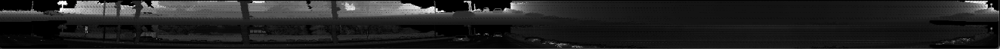  

An example range image

#### show_pcl
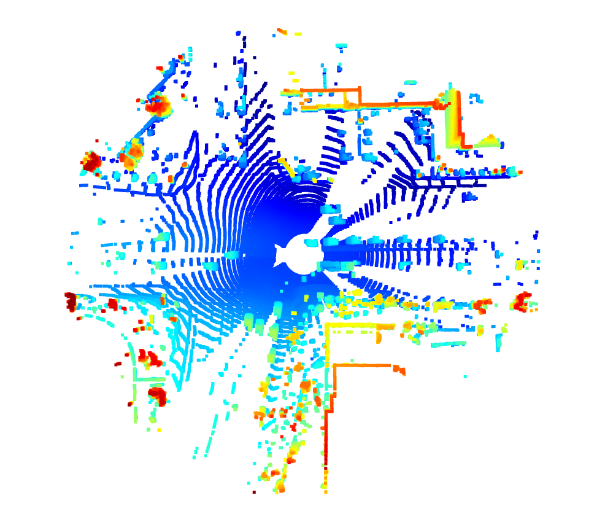  

An example point cloud visualization

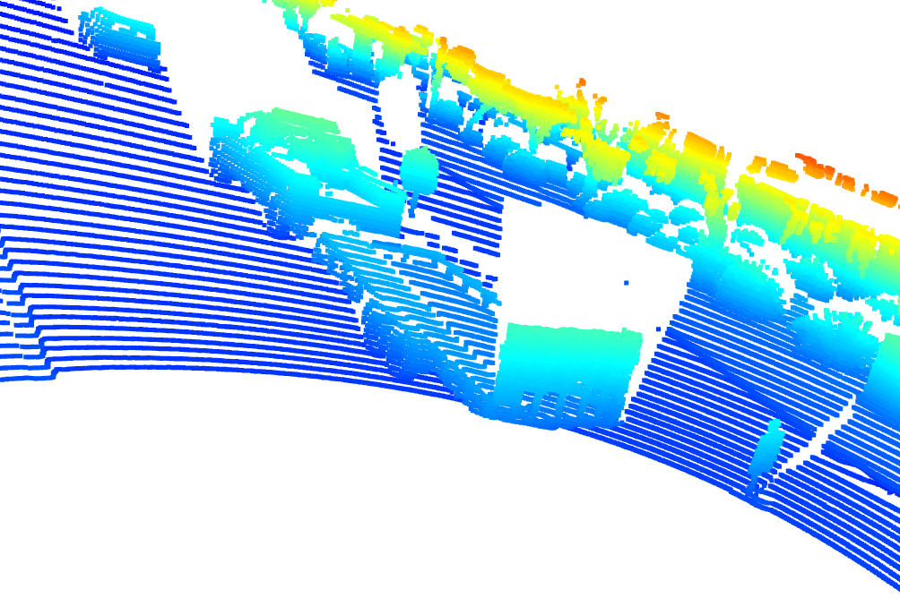  

An example point cloud visualization

### Convert sensor coordinates to BEV-map coordinates (ID_S2_EX1)
#### bev_from_pcl

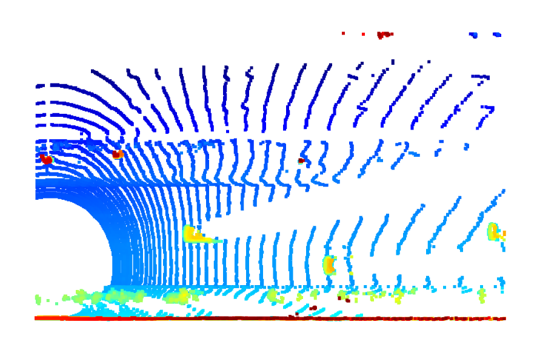  

An example visualization into BEV map coordinates

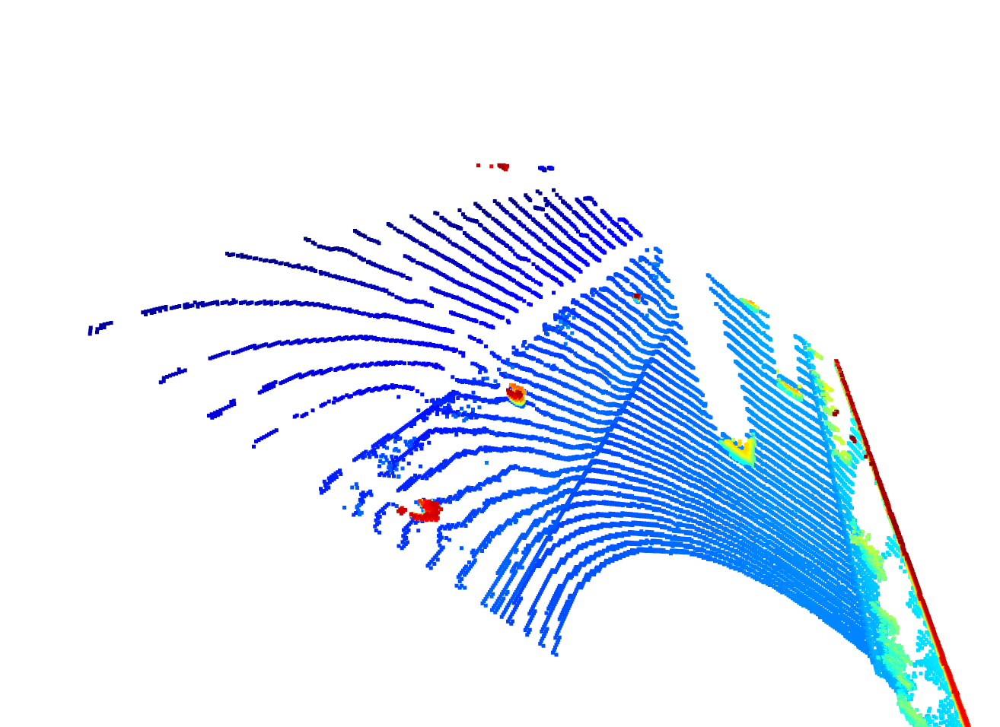  

An example visualization into BEV map coordinates

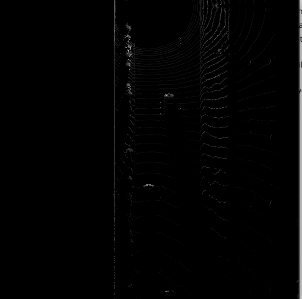  

An example intensity layer from the BEV map

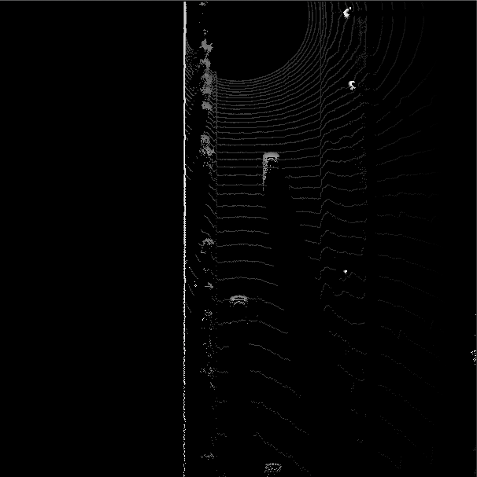  

An example height layer from the BEV map

### Add a second model from a GitHub repo (ID_S3_EX1)

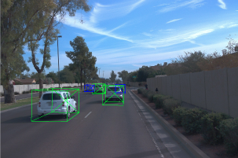  

3D bounding boxes added to the images

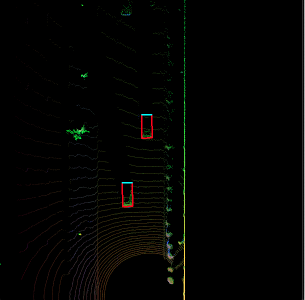  

3D bounding boxes added to the images

### Compute intersection-over-union between labels and detections (ID_S4_EX1)
#### objdet_eval

`precision = 0.9508196721311475, recall = 0.9477124183006536`

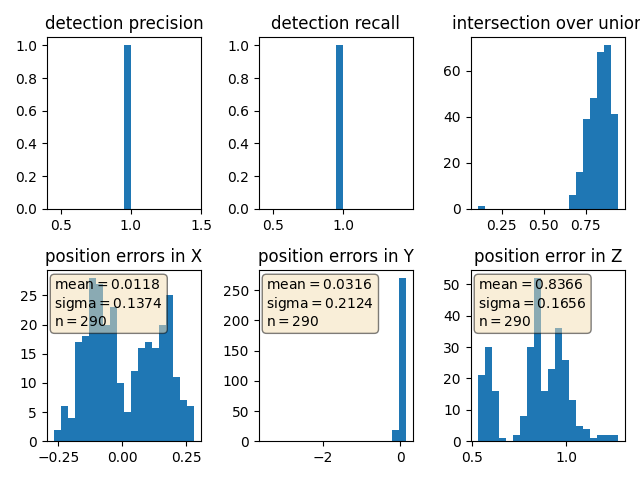  

Graphing performance metrics  

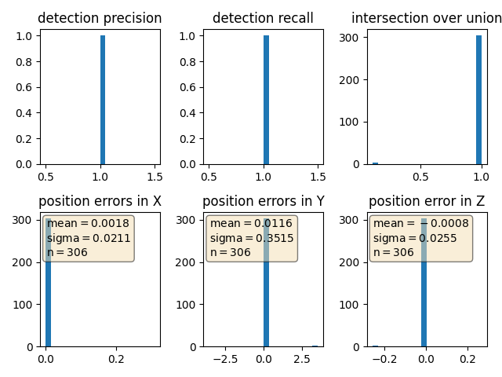  

Using the labels, metrics should get perfect scores
